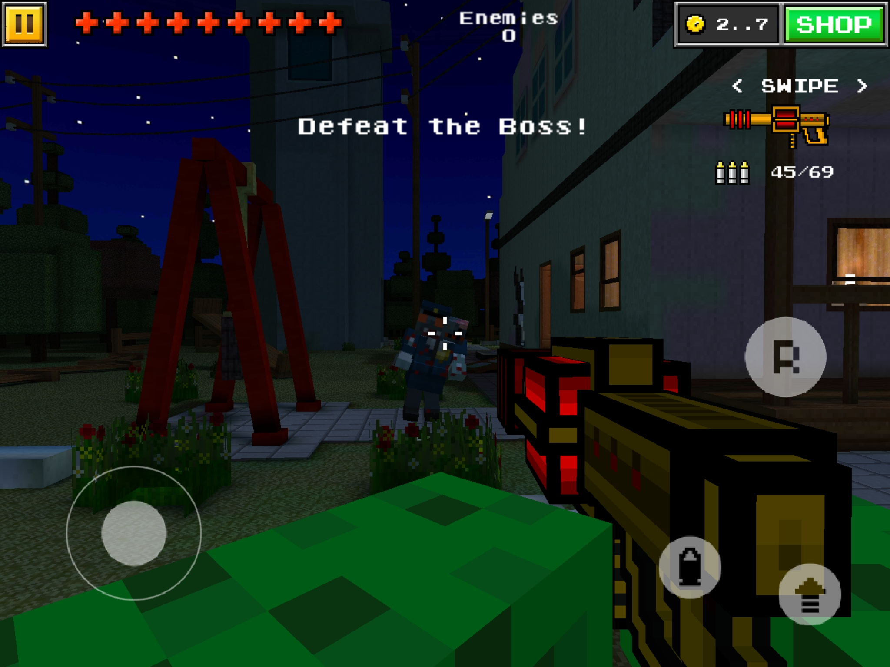

# install pixel gun 7.1.1

[Click here to access both files](https://www.dropbox.com/scl/fo/p217a8xnmqy3wc41eq43h/h?dl=0&rlkey=wufict8wkt35kyws4utgwm5f4)

you first need the .OBB file containing folder which is in the dropbox to place it in the Device/Android/obb folder (it might not work with the pc directly so sometimes you need to make the last move into the folder trought your device and not the PC)

then you also have the APK
once the game is downloaded trought the APK
you will get this screen when opening

Now don't fear, its exactly what you want to see, once you restart the app, the game launches and works perfectly (close it as well)

i have also created a network on [zerotier one](https://d.apkpure.com/b/APK/com.zerotier.one?version=latest) since online play doesn't work
so once you downloaded it you join this adress: **1d71939404a9ec24**
if you're lucky many other people did that before too and you might be able to play with more people

### enjoy your game!!

